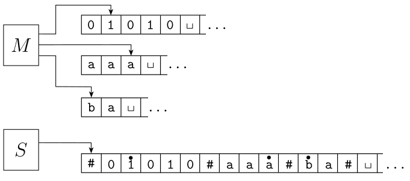
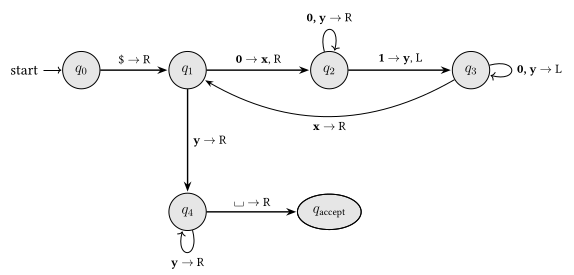

# Turing Machines

## Multi-tape Turing Machines
Modify the single tape turing machine by adding another tape. This is the same as
a single TM, but we can work with multiple strings

Say we have the following three strings:

\\(01q_1011\\)  
\\(000q_1\\)   
\\(q_11010\\)

These can be flattened into one TM:

\\(
01q_1011\\#
000q_1\\#
q_11010
\\)

If we shift the string down by one to denote the left-hand-side of the string,
we can make a TM that moves back and forth between the different strings.

\\(
$01q_1011\\#
000q_1\\#
q_11010
\\)

Add to \\(\Gamma, \dot{\Sigma}\\) all symbols of the input alphabet with
\\(\dot{}\\) above it, \\(\\#\\), and \\(\dot{\\#}\\)

S = "On input \\(w = w_1, w_2,...,w_n\\)
1. \\(\\#\dot{w_1}w_2...w_n\\#\dot{-}\\#\dot{-}\\#...\\#\\)
2. Move right, read symbols under each tape head
3. Second pass, move left, update tapes according to M's transition function
4. If TM encounters \\(\dot{\\#}\\), then it reached an unread blank portion
   of the tape. It writes a blank, and shifts all the content right of
   \\(\dot{\\#}\\) to the right

So, we can emulate multiple tapes with a single-tape TM. However, we have a time
cost. If our string has max length n, moving back and forth along the tape to
update positions take up to n times as many steps.

## Non-Deterministic Turing Machines
We can also have non-deterministic turing machines, where there are multiple
possible arrows out of a state. We accept if *any* choice leads to the accepting
state. 

\\(
q_0 $01x \rightarrow $q_101x \rightarrow $xq_21x \rightarrow $xyq_3x
\\)

From here, we have two choices to follow:  
\\($xyxq_1 \rightarrow \\) reject  
\\($xyxq_2 \rightarrow \\) accept

We can simulate a non-deterministic TM by performing a breadth-first search on
the configuration tree using multi-tape TMs

**input tape** contains the unaltered input  
**simulation tape** simulates some branch of the NTM  
**address tape** tells us what branch we're on

Start at the root, follow the first child, second child, third child,...

1. Initially, tape 2, 3 empty, 1 contains input \\(w\\)
2. Copy 1 to 2, initialize string on 3 to be \\(\epsilon\\)
3. Simulate n on 2, consult 3 for next branch to follow  
   If branch invalid, go to 4 (also if reject)  
   Elseif no tape 3 symbol, go to 4
4. Replace tape 3 string with next string in ordering  
   Simulate next branch by going to 2

So, we can simulate a NDTM with a TM. Similarly, there is a time cost. The
size of the tree can be exponentially large in height, so doing a BFS on a
configuration tree of an NTM can take exponentially longer than the running
time of the NTM.
