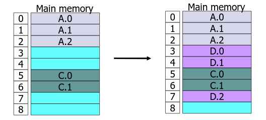

# Paging
Paging no longer looks at processes as one big chunk of contiguous memory. We
divide a processes' memory into chunks of the same size, called *pages*.

To contain pages, we partition memory into equal, fixed-size chunks called
*page frames* or *frames*. To simplify translation, page frame sizes are powers
of 2.

To store a process divided into N pages, we will need N available page frames,
that dont necessarily have to be contiguous!

Pages up to N-1 are all filled, and only the last page may be non-full. This
means internal fragmentation is isolated to at most one page per process. As
well, no external fragmentation occurs.

