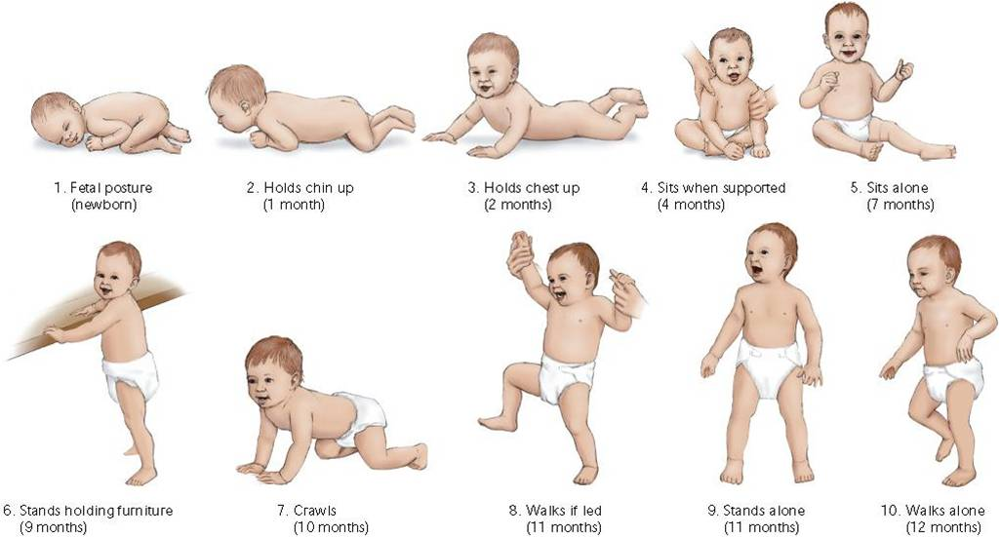
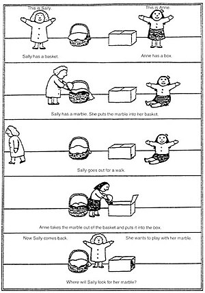

# Developmental Psychology (Part 3)

Trisha is pregnant with her second baby. At 4 weeks gestational age, Trisha ingests a teratogenic substance.
From this list, what is the fetal structure MOST likely to be adversely affected by this ingestion?
1. Teeth
2. Genitalia
3. Palate
4. Heart
> Heart

Which of the following pieces of evidence does NOT directly support the notion that fetal perception and
learning takes place prior to birth?
1. 2-hours-old newborn Yvette turns her head away from a startling sound
2. The heart rate of a 35-week-old fetus decreases in response to the sound of its mother's voice speaking,
   but not in response to other people speaking
3. 3-hours old newborn Mark sucks on a pacifier faster when he hears Engish, his mother's language, than
   when he hears French or Japanese.
4. Newborn infants whose mothers ate a lot of ginger during pregnancy are more likely to turn their heads
   towards the smell of ginger than are babies whose mothers did not eat ginger during pregnancy.
> 2-hours-old newborn Yvette turns her head away from a startling sound

Name ONE motor reflex that a newborn baby produces. Use ONE WORD.
> crying

## Perceptual Development
Begins in utero, but experiences after birth are much *richer*.

**Sensation**: Detection of physical signals in environment

**Perception**: Organization, interpretation of information to understanding of objects, individuals, events
* Infants spend more time looking at interesting, stimulating, or familiar objects and events, called **preferential looking**.
* Most prefer patterned images over gray ones (more interesting)
* More time looking at gray ones vs. patterned ones indicates low **visual acuity** (eyes arent developing well)

Infant acuity about 20/120 and catches up quickly, adult-like at 6 months

## Motor Development
Newborn's motor skills mostly reflexes

These reflexes dissipate after infancy
* grasping - put finger in hand -> baby grasps
* rooting - *feeding reflex*, rub check -> turn head -> start sucking
* sucking - *feeding reflex*
* swallowing - *feeding reflex*
* tonic neck reflex - turn head in direction arm is facing

Thought to be evolutionary vestige (leftover)

Some last for the entire lifespan
* coughing
* sneezing
* blinking
* withdrawal from pain

**Cephalocaudal rule**: Top -> bottom - Tendency for motor skills to emerge in sequence from head to foot  
**Proximodistal rule**: Inside -> outside - Tendency for motor skills to emerge from the center to the periphery (far from the body)

> Samantha is 8 months old. Which of these behaviours would you *not* expect her to be doing?  
> Walking up steps, walking alone

## Cognitive Developmet
At the same time perceptual and motor abilities develop, children learn to think about the world around them.

**Jean Piaget**, Swiss psychologist pioneered understanding of cognitive development by dividing it into stages
1. Sensorimotor (0-2 years)
    * Infants rely on sensual and motor movements to learn about the world
2. Pre-operational (2-6 years)
    * Move from **egocentrism** to **sociocentrism** (from only own perspective to others)
    * Develop **theory of mind** - understanding behaviour guided by mental representations
3. Concrete operational (6-11 years)
4. Formal operational (11 years - adulthood)

> More of these in textbook, make sure to look at

Progress from stage to stage as they gain knowledge about the world around them
~~~~
Acquire knowledge about some domain
Organize into a **schema/framework**
Acquire some new knowledge
Fit understanding?
    **Assimilation**: Add to existiing framework 
Doesn't fit understanding?
    **Accomodation**: Modify schema heavily, or create new schema
~~~~

### False Belief Task
Change of Location task - failed by most 3 year olds  

False Belief Task - failed by most 3/4 year olds  

> Would never include the mom in these tests. Babies believe mothers know everything

Piaget Criticisms
* Underestimated abilities of infants and young children.
    * Infants have trouble with language abilities
    * Are able to look in the right direction when done non-verbally
* Stages suggest there is some kind of 'overnight switch'
    * Development is continuous
* Underestimated how sociocentric infants are
    * Infants follow gaze of caregivers (shared attention)

### Attachment
Emotional bond with caregivers (attachment figure). Individual differences in attachment measured by:
* Extent to which an infant uses caregiver as a **secure base**
* How infant reacts to **reunion** with caregiver after short separations

### Strange Situation Procedure
~~~~
Mother plays with baby
Stranger enters room
Mother leaves
Stranger tries to play with baby
Mother comes back (reunion)
~~~~
* **Secure Attachment**: Most advantageous for babies moving forward
* **Insecure Attacmhemnt**:
    * **Avoidant**: Not concerned with mother when in room, avoids mother in reunion
    * **Resistant/Ambivalent**: Running toward mother, then acting angrily towards mother when mother tries to comfort
    * **Disorganized**: Fear behaviour/involuntary movement. Experienced some trauma
**Attachment style** predicts:
* Academic achievement
* Emotional health
* Relationship quality
* Self-esteem

