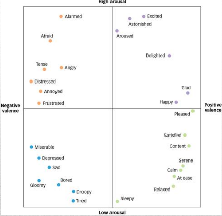

# Emotion

Which of the following is FALSE with respect to the normal distribution?
1. The normal distribution is symmetrical (the same on both sides)
2. The normal distribution is centered around the mean
3. All naturally-occuring variables are normally distributed
4. On a particular normally distributed variable, approximately 16% of
   individuals' scores fall above one standard deviation above the mean.
5. On a particular normally distributed variable, approximately 2% of
   individuals' scores fall below two standard deviations below the mean.
> All naturally-occuring variables are normally distributed

James scores 85 on an IQ test designed for his age and location. In what
percentile does James' score fall?
1. 85th percentile
2. 16th percentile
3. 50th percentile
4. 25th percentile
5. 2nd percentile
> 16th percentile

Which of the following is NOT a part of Carroll's basic intelligence stratum
(the second level)? THere is more than one right answer: select them all!
1. g
2. fluid intelligence
3. crystallized intelligence
4. printed language comprehension
5. broad visual perception 
> g  
> printed language comprehension

## Views of Intelligence

Gardner's Theory of Multiple Intelligences
* People have at least 7 types of intelligence necessary for functioning and
  survival
* Not based on writte/verbal tests
* Based on self-reporting and behavioural observation

*Nature intelligence is a new one that was added*  
*The three red ones correlate to ones from Caroll's model*

* Damage to specific brain area may impact one type of intelligence, but not
  others
* Areas of intelligence develop at different rates

Flynn Effect Slope:
* IQ scores consistently rising around the world
* Possible cuases are increased nutrition, health, better formal education,etc.

## Emotional Intelligence
The ability to reason about emotions and to use emotions to enhance reasoning.
Emotional intelligence is not tested by traditional IQ tests.

Individuals with **high** emotional intelligence show less brain activation when
solving emotional problems.

**Emotion**: *posiive* or *negative* response to stimulus(internal thought or
external environmental events)
* Physiological: racing heart, tense muscles
* Cognitive: subjective conscious experience
* Behavioural: characteristic overt expressions, facial expressions, posture

* Defined by valence(positive or negative) and psychological arousal (severity)

Emotions developed as a way for us to survive(happiness to increase social
cohesion, fear to keep out of danger, anger to overcome obstacles, etc.)

## Theories of Emotion

Theories of emotion disagree on what cause emotion
* Preception of stimulus
* Physiological state
* Cognitive interpretation of stimulus

**Common Sense View**
stimulus > emotion > arousal  
see a bear > causes fear > causes increased heartrate

**James-Lange Theory**
stimulus > arousal > emotion  
see a bear > causes increases heartrate > causes experience of fear

**Cannon-Bard Theory**
stimulus > emotion & arousal  
see a bear > causes increased heartrate AND experience of fear separately

**Schachter-Singer Two-Factory Theory**
stimulus > arousal > cognition > emotion  
stimulus causes physiological state, brain interprets that state emotionally,

## Neuroscience View
Related neural structures to emotion:
* Amygdala - primitive, quickly processes biologically relevant information
* Prefrontal cortex - advanced, slowly processes information rationally

Friend tries to scare you, thalamus processes the sound, movement, etc. and
sends to the amygdala and prefrontal cortex

Amygdala immediately triggers survival based fear response  

Prefrontal cortex makes you calm down, laugh.

## Emotional Regulation
Emotional regulation is a somewhat learned strategy. Adults are good at
regulating emotions, younger children are not. There are several factors:
* Internal feeling state (how we feel)
* Emotion-related cognitions
* Emotion-related physiological processes
* Emotion-related behaviour

Much is related to **temperament**
* Levels of emotionality(positive/negative)
* Ability to self-regulate emotion
* Predominantly biologically based

Infant strategies (begins to appear after 6 months):
* **Gaze aversion**
* **Self-soothing**

Strategies:
* **Distraction** by thinking/doing something else from experiences (more often
  negative stimuli)
* **Suppression** of negative thoughts
* **Affect Labelling**, naming emotional experiences
* **Re-appraisal**, think of emotion-inducing stimulus in a different way
